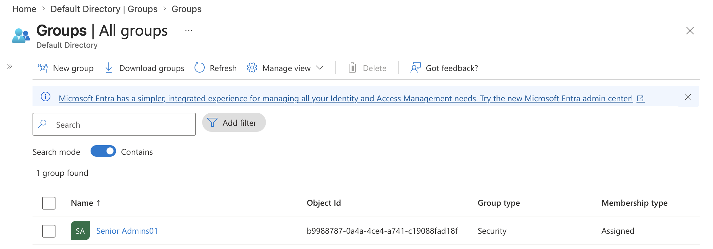
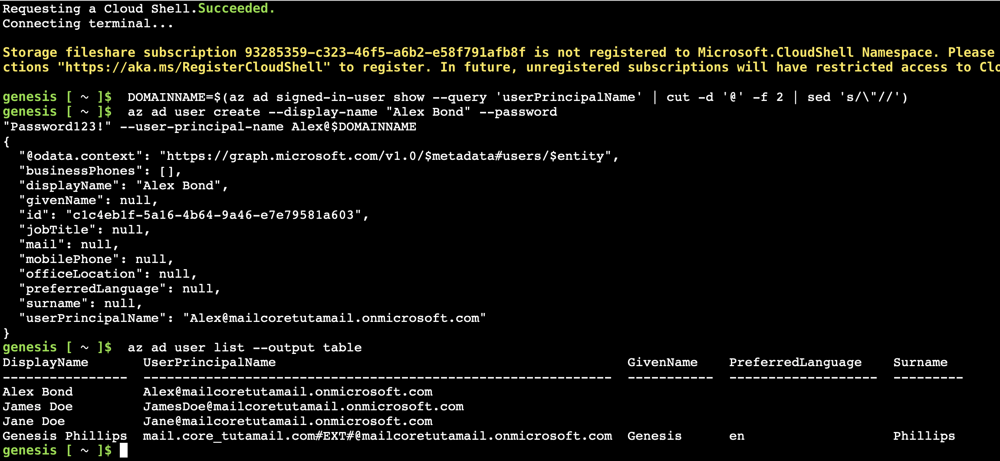
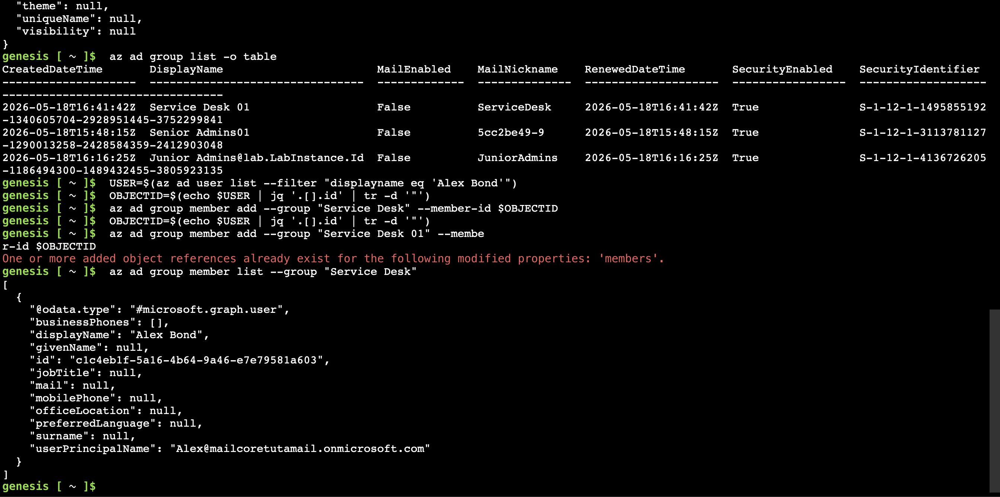
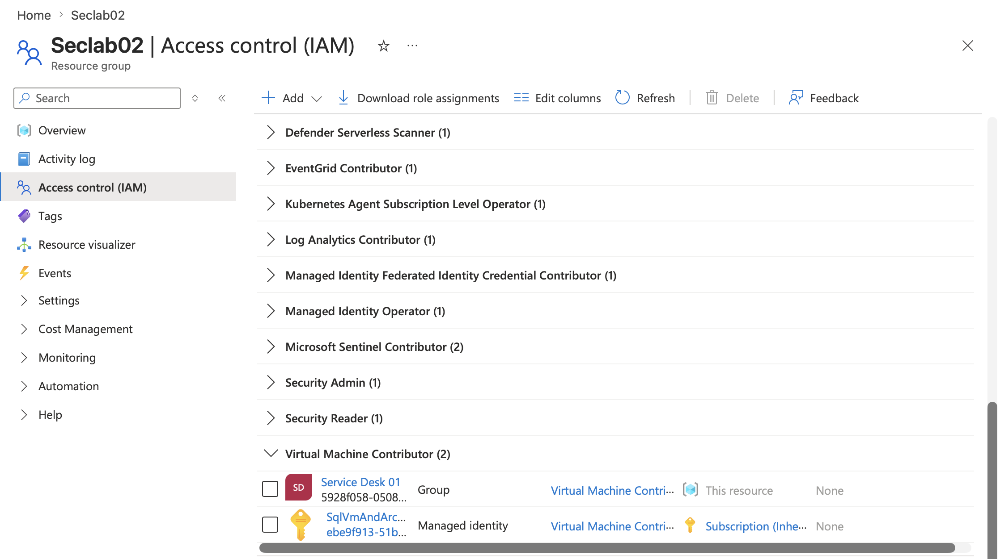

# Secure Azure Identity Environment

## Securing Azure Identity with RBAC

### Objective

Implement identity and access management controls in Azure using Microsoft Entra ID groups and Azure Role-Based Access Control (RBAC) to enforce least privilege access, improve administrative separation, and reduce the risk of unauthorised privilege escalation.

---

## RBAC Architecture Diagram

---

## Implementation (Security Controls)

- Create role-aligned Microsoft Entra ID groups to enforce administrative separation and reduce excessive privilege exposure.
- Implement group-based RBAC instead of direct user role assignments to simplify identity governance and improve access management scalability.
- Assign the Virtual Machine Contributor role to the Service Desk group to provide VM management capabilities without broader administrative permissions.
- Use Azure Portal, PowerShell, and Azure CLI workflows to demonstrate operational flexibility across multiple administration interfaces.

---

## Architecture Decisions

- Use security groups as the RBAC boundary to improve scalability, auditing, and identity lifecycle management.
- Separate administrative functions into dedicated groups to support Zero - - Trust principles and reduce lateral movement risk.
- Select the Virtual Machine Contributor role to enforce least privilege while still enabling operational support tasks.
- Avoid direct user-to-role assignments to minimise long-term privilege management complexity and reduce configuration drift.

---

## Validation

---

## Key Learnings
